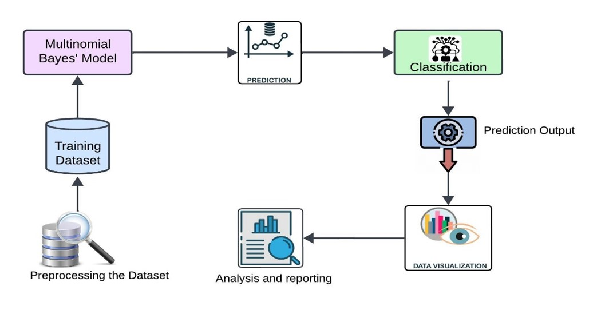

# Utilizing Multinomial Naive Bayes for Enhanced Movie Genre Classification and Analysis

This project applies the Multinomial Naive Bayes classifier to predict movie genres based on various metadata, including descriptions and ratings. The dataset is sourced from Kaggle. Detailed analysis and visualizations are provided below.

## Table of Contents

- [Introduction](#introduction)
- [Workflow Diagram](#workflow-diagram)
- [Related Work](#related-work)
- [Data Abstraction](#data-abstraction)
- [Task Description](#task-description)
- [Tools Description](#tools-description)
- [Visualization Graphs](#visualization-graphs)
- [References](#references)
- [Links](#links)

## Introduction

This project aims to classify movies into genres using the Multinomial Naive Bayes classifier, leveraging various factors such as descriptions, ratings, and metadata. The goal is to enhance content recommendation systems by accurately predicting movie genres.

## Workflow Diagram

The workflow diagram illustrates the steps taken in our project, starting from data acquisition to preprocessing, analysis, visualization, and reporting. The data was obtained from Kaggle, cleaned, and prepared for detailed exploratory data analysis (EDA).

## Related Work

Exploring movie genre classification trends is essential for understanding the industry's dynamics. Several studies have focused on different machine learning approaches and their effectiveness in classification tasks, providing a foundation for our analysis.

## Data Abstraction

The dataset used for this project is in CSV format, containing various attributes like movie titles, descriptions, ratings, and genres. It includes 8,807 entries, offering a comprehensive view of Netflix's movie catalog.

## Task Description

### Target Audience

Our primary audience includes data scientists, machine learning enthusiasts, and professionals in the multimedia entertainment industry. This project provides insights into improving genre classification for better content recommendations.

### Actions

The main actions performed in this project include data acquisition, preprocessing, analysis, visualization, and reporting. These steps transform raw data into actionable insights that enhance movie genre classification.

## Tools Description

### Data Processing & Visualization Tools

- **Python:** For data analysis and processing.
- **Pandas:** For data handling and manipulation.
- **Matplotlib and Seaborn:** For creating visualizations.
- **Jupyter Notebook:** For interactive coding and visualization.
- **Kaggle:** For dataset acquisition.

## Visualization Graphs

### 1. Movie Genre Distribution

Distribution of movies across different genres.

### 2. Movie Ratings by Genre

Analysis of movie ratings across various genres.

### 3. Genre Prediction Accuracy

Accuracy of genre prediction using Multinomial Naive Bayes.

## References

1. [Data Science 2023 Review: Trends and Salary Expectations](https://www.smithhanley.com/2023/12/05/data-science-2023/)
2. [Data Science & AI Professionals Salary and Hiring Trends](https://www.burtchworks.com/industry-insights/new-report-data-science-ai-professionals-salary-and-hiring-trends)
3. [Salary Trends: What to Expect in Data & Analytics Roles in 2024](https://www.linkedin.com/pulse/salary-trends-what-expect-data-analytics-roles-2024-douglas-robertson/)
4. [Trends in Data Science Salaries: An Exploratory Data Analysis Journey](https://medium.com/@ry4ntr1/trends-in-data-science-salaries-an-exploratory-data-analysis-journey-9b70b75be48e)
5. [EDA and Visualizations on Data Science Salaries using Python](https://www.linkedin.com/pulse/eda-visualizations-data-science-salaries-using-python-krishnamohan/)
6. A. Kaur, D. Verma, and N. Kaur, "Utilizing Quantitative Data Science Salary Analysis to Predict Job Salaries," 2022 2nd International Conference on Innovative Sustainable Computational Technologies (CISCT), Dehradun, India, 2022, pp. 1-4. [IEEE](https://ieeexplore.ieee.org/document/10046491)
7. Tee, Zhen & Raheem, Mafas. (2022). Salary Prediction in Data Science Field Using Specialized Skills and Job Benefits - A Literature Review. [ResearchGate](https://www.researchgate.net/publication/362280362_Salary_Prediction_in_Data_Science_Field_Using_Specialized_Skills_and_Job_Benefits_-A_Literature_Review)

## Links

- [Kaggle Dataset](https://www.kaggle.com/datasets/ginnyshai/netflix-dataset)
- [GitHub Repository](https://github.com/your-repo-link)
