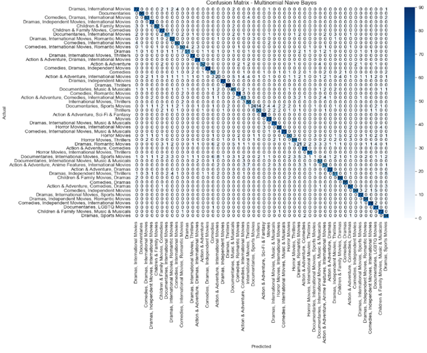
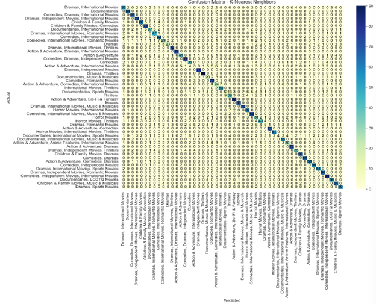
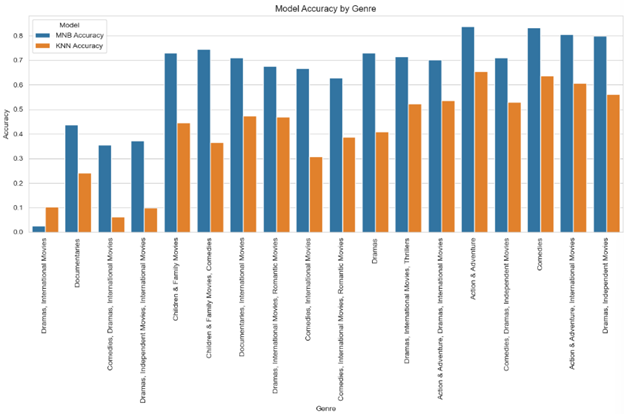
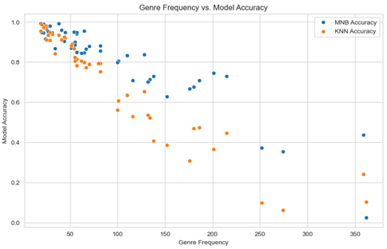
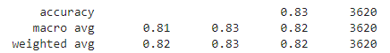

# Netflix Movie Genre Classification

This repository contains a project focused on classifying movie genres using the Multinomial Naive Bayes classifier. The goal is to improve genre classification accuracy, thus enhancing recommendation systems for streaming platforms like Netflix.

## Table of Contents

1. [Introduction](#introduction)
2. [Dataset](#dataset)
3. [Model](#model)
4. [Results](#results)
5. [References](#references)

## Introduction

In the constantly developing multimedia entertainment industry, particularly classifying movies into genres is a challenging yet essential task for more effective user suggestions and content management. This project provides a unique approach to this issue through using the Multinomial Naive Bayes classifier on a mixed and diverse movie dataset.

## Dataset

The dataset used in this project is sourced from Kaggle. It contains a comprehensive collection of movie and TV show data from Netflix, including titles, directors, actors, country, year, and descriptions.

- [Netflix Dataset on Kaggle](https://www.kaggle.com/datasets/ginnyshai/netflix-dataset)

## Model

The Multinomial Naive Bayes classifier is particularly suited for this project due to its effectiveness in text classification and handling of categorical data. The model is trained on movie descriptions, leveraging the Term Frequency-Inverse Document Frequency (TF-IDF) vectorization method to convert text data into numerical format.

### Environment Setup

- **Python**: 3.8 or newer
- **Libraries**:
    - Pandas
    - NumPy
    - Scikit-learn
    - Matplotlib
    - Seaborn
    - Jupyter Notebook

## Results

The model was evaluated using various metrics such as accuracy, precision, recall, and F1-score. The Multinomial Naive Bayes classifier showed high precision in genre classification and outperformed traditional methods like Decision Trees, K-Nearest Neighbors, and Support Vector Machines.

### Visualization

Visualizations such as confusion matrices, bar plots, and line graphs were used to illustrate the model's performance. These visualizations help in understanding the strengths and limitations of the classifier.

**Confusion Matrix**

**Accuracy Comparision between MNN and KNN**

**Correlation B/W Genre Frequency and Model Accuracy**

**MNB Accuracy**

## References

1. [Collaborative Filtering Recommender System Based on Memory Based in Twitter Using Decision Tree Learning Classification](https://ieeexplore.ieee.org/document/10055248)
2. [A comprehensive survey on support vector machine classification: Applications, challenges and trends](https://dblp.org/rec/journals/ijon/CervantesGRC20.html)
3. [A multimodal approach for multi-label movie genre classification](https://link.springer.com/article/10.1007/s11042-020-10086-2)
4. [A Movie Recommendation System Design Using Association Rules Mining and Classification Techniques](https://wseas.com/journals/articles.php?id=6857)
5. [Multinomial Naїve Bayes for Documents Classification and Natural Language Processing (NLP)](https://towardsdatascience.com/multinomial-na%C3%AFve-bayes-for-documents-classification-and-natural-language-processing-nlp-e08cc848ce6)
6. [Installing Jupyter](https://jupyter.org/install)
7. [Anaconda Software Distribution](https://docs.anaconda.com/)
8. [Pandas Library](https://pandas.pydata.org/)
9. [NumPy The fundamental package for scientific computing with Python](https://numpy.org/)
10. [scikit-learn: Machine Learning in Python](https://scikit-learn.org/stable/index.html)
11. [Matplotlib: Visualization with Python](https://matplotlib.org/)
12. [seaborn: statistical data visualization](https://seaborn.pydata.org/)
13. [Multilabel Genre Prediction Using Deep-Learning Frameworks](https://www.mdpi.com/2076-3417/13/15/8665)
